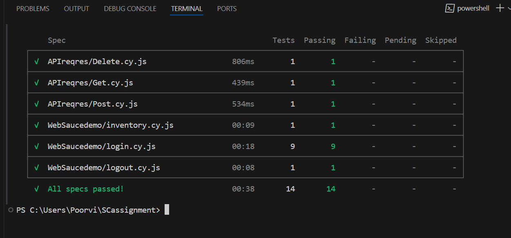

**Cypress Test - **

A suite of automation tests written with JavaScript and automated with Cypress JS framework, for the website https://www.saucedemo.com/, and API - https://reqres.in.

**Project technologies -** 

JavaScript as programming language

Node.js as runtime environment

Cypress as automation framework for web applications

Google Chrome as test browser

**Setup and installation**

1. Download and Install nodejs - https://nodejs.org/en/download/prebuilt-installer
2. Download and Install vscode - https://code.visualstudio.com/download
3. Open terminal and then execute below command 

   npm -i init    ---> To create package.json file 

4. To install Cypress 

   npm install cypress --save -dev

5. Start cypress 

   npx cypress open 

6. Configure for new project 
      
      Or
7. After Installation open project SCassignement 

8. Running the project - 

npx cypress run 

Run using chrome browser - npx cypress run -- browser chrome

Run using headed mode - npx cypress run -- browser chrome --headed

Run specific spec - npx cypress run --spec cypress\e2e\APIreqres\Delete.cy.js -- browser chrome --headed

**Support** - 

Web support - 

https://www.saucedemo.com/

API support - 

https://reqres.in.

**Project Structure** - 

### Web Tests

- `cypress/e2e/WebSaucedemo/`: Contains the UI test specifications.

  - `login.cy.js`: Tests for login functionality.
  - `inventory.cy.js`: Tests for inventory page and cart functionality.
  - `logout.cy.js`: Tests for the logout functionality.

- `cypress/support/commands.js`: Contains custom Cypress commands.

- `cypress/support/e2e.js`: Loads custom commands.

### API Tests

- `APIreqres/`: Contains the API test specifications.

  - `post.cy.js`: Tests for POST requests.
  - `get.cy.js`: Tests for GET requests.
  - `delete.cy.js`: Tests for DELETE requests.

  ***Test cases** - 

Web cases - cypress\e2e\WebSaucedemo

cypress\e2e\WebSaucedemo\login.cy.js

TC-01 - Verify URL should load login page
TC-02 - Verify with Valid username and password login should be successfull
TC-03 - Verify with Invalid username and password error should be displayed
TC-04 - Verify with InValid username and Valid password error should be displayed
TC-05 - Verify with Valid username and InValid password error should be displayed
TC-06 - Verify with empty username error should be displayed
TC-07 - Verify with empty password error should be displayed
TC-08 - Verify with empty username and password error should be displayed
TC-09 - Verify login with locked out user error should be displayed

cypress\e2e\WebSaucedemo\inventory.cy.js

TC-10 Verify Inventory page displays 6 items
TC-11 Verify Adding Sauce Labs Onesie to the cart
TC-12 Verify the cart badge shows 1 item
TC-13 Verify clicking on the cart icon to view the cart
TC-14 Verify that the cart contains Sauce Labs Onesie

cypress\e2e\WebSaucedemo\logout.cy.js

 TC-15 Verify user is logged out
 TC-16 Verify redirection to the login page

 API cases - cypress\e2e\APIreqres

cypress\e2e\APIreqres\Post.cy.js
 Creation of new user

 cypress\e2e\APIreqres\Get.cy.js
 Fetching Single user

 cypress\e2e\APIreqres\Delete.cy.js
 Deleting user by id 

 

[cypress\screenshots\Result.png]: cypress\screenshots\Result.png
[def]: screenshots/Result.png